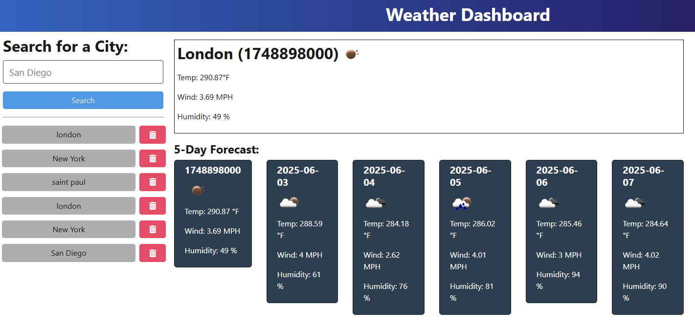

# Weather Dashboard

Build a weather dashboard application that calls the OpenWeather API and renders data in the browser.

* Use the [5-day weather forecast API](https://openweathermap.org/forecast5) to retrieve weather data for cities.

* Register for a new API key

* The base URL should look like the following:

  ```url
  https://api.openweathermap.org/data/2.5/forecast?lat={lat}&lon={lon}&appid={API key}
  ```


## Screenshots



## Render Link

[Weather-Dashboard Render](https://challenge9-88kd.onrender.com/)

## Github Repo

[Weather-Dashboard Repo](https://github.com/lobungen/Challenge9)

## Weather Dashboard Features

- Temp
- Wind
- Humidty
